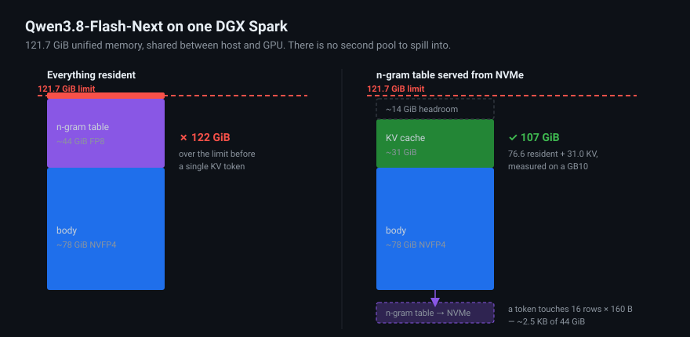

# qwen38-flash-next-spark

**Running Qwen3.8-Flash-Next — the Qwen4 architecture preview — on a single NVIDIA DGX Spark (GB10, 128 GB).**

A ~180B-parameter model on one 128 GB box, with a real KV cache, native vision, and 262k of context. Two serving paths (vLLM and SGLang), verified weights, and every trap we hit written down.

> **Status: it runs, and vision works.** Verified on a DGX Spark: 79.42 GiB resident, all canaries pass, and the vision tower survives the mmap path — **the first documented multimodal inference of this model on a single GB10**. Two obvious optimisations turned out to do nothing. Our first throughput numbers were **undercounts** — the harness counted SSE chunks, and speculative decoding puts several tokens in one chunk; that is fixed and documented, and Flash-Next is pending re-measurement. Numbers, method and the refuted hypotheses are in [`docs/BENCHMARKS.md`](docs/BENCHMARKS.md); raw JSON in [`results/`](results/).

---

## Why this is hard

Qwen3.8-Flash-Next is not a 125B model in the way that number suggests. It is:

| component | params | size (this checkpoint) |
|---|---:|---:|
| main MoE body (512 experts, 10 routed + 1 shared) | 125B | ~78 GiB NVFP4 |
| n-gram embedding table ("PLE") | 51B | **~44 GiB FP8** |
| MTP speculative head | 4B | small |
| **total** | **~180B** | **~122 GiB** |

A DGX Spark has **121.7 GiB of unified memory shared between host and GPU**. The body alone leaves ~44 GiB. The n-gram table alone is ~44 GiB. Together they do not fit, and that is before a single token of KV cache.

**The trick:** a token only ever touches **16 rows × 160 bytes** of that 44 GiB table. So the table does not need to be resident — it can live on NVMe and be served through the page cache. That is exactly what llama.cpp does with GGUF mmap, and what [blazux/qwen3.8-Flash-DGX](https://github.com/blazux/qwen3.8-Flash-DGX) does to vLLM in one patched file.

<p align="center">
  
</p>

The counter-intuitive result: the paging **gets cheaper under load**. Major faults per token fall ~4.4× from 1 to 48 concurrent streams, because batched tokens share n-gram rows and the page cache keeps the hot set. This is an argument *for* running the model concurrent, not a caution against it.

---

## Quick start

```bash
git clone https://github.com/karti-ai/qwen38-flash-next-spark
cd qwen38-flash-next-spark

# 1. Weights: ~122 GiB, 419 files. Downloads, then verifies every shard.
DEST=$PWD/weights/Qwen3.8-Flash-Next-NVFP4 scripts/download-weights.sh

# 2. Build the patched vLLM image (official image + one vendored patch, ~1 min)
docker build -t qwen38-flash-next-spark .

# 3. Serve. First boot reads ~79 GiB of weights — about 16 minutes, measured.
WEIGHTS=$PWD/weights/Qwen3.8-Flash-Next-NVFP4 scripts/serve-vllm.sh

# 4. Prove it works
scripts/smoke-test.sh
```

**Requirements:** DGX Spark / ASUS GX10 or other GB10 (sm_121), 128 GB unified memory, aarch64, Docker with the NVIDIA runtime, and **~130 GiB of free NVMe** — the n-gram table is read from that directory on the token path, so it should not be a spinning disk or a network mount.

---

## Do not skip the checksum step

The single documented reproduction failure of this recipe was not a driver, a kernel, or a config problem. It was **two safetensors shards that were the correct size and the wrong bytes**, left behind by a stalled download.

A byte-corrupt shard loads cleanly, reports correct tensor shapes, produces activations of correct magnitude, and yields **fluent, confident token salad** that survives every configuration change you can think of — MoE backend, attention backend, CUDA graph mode, speculative decoding. Comparing file *sizes* against the Hub API does not catch it. The person who hit this bisected driver and firmware versions for a day first.

The Hub publishes `lfs.sha256` for every object in the same API response most tools already parse. [`scripts/verify-weights.py`](scripts/verify-weights.py) uses it, works on any HF repo, and tells you exactly which files to re-fetch:

```bash
python3 scripts/verify-weights.py \
  --repo RadixArk/Qwen3.8-Flash-Next-NVFP4 \
  --dir  ./weights/Qwen3.8-Flash-Next-NVFP4
```

---

## Traps

Each of these costs hours if you meet it cold.

| trap | what you see | the actual cause |
|---|---|---|
| **fp8 KV cache** | boot failure | The QSA layers **refuse** fp8 KV. Keep `--kv-cache-dtype auto`. This is the *opposite* of most Qwen checkpoints, so do not copy the flag across configs. |
| **`--max-num-seqs` too low** | throughput plateaus, looks like saturation | It is a request cap, not a ceiling. A value of `2` costs ~4× aggregate throughput at c=8. Saturation and a cap are indistinguishable in tok/s alone — read `vllm:request_queue_time_seconds_sum`. |
| **CUDA graph mode** | Inductor int64 indexing assert on sm_121 | The PLE gather is CPU work plus a pageable H2D copy and cannot live inside a capture. Use `PIECEWISE`, never `FULL*`, with `vllm::ple_mmap_lookup` in the splitting ops. |
| **PLE quant gate** | `no module or parameter named 'ngram_embedding.weight_scale'` | vLLM's `_get_ple_embedding_quant_method()` accepts only `Fp8Config`, but this checkpoint pairs an FP8 PLE with an NVFP4 body (`modelopt_fp4`). Accepting `modelopt`/`modelopt_fp4` fixes it — **which means RadixArk NVFP4 does load on vLLM**, contradicting the compatibility tables in circulation. |
| **PLE CPU offload in Docker** | `pidfd_getfd: Operation not permitted`, ~10 min into boot | Not seccomp — `kernel.yama.ptrace_scope=1`. The offload worker and GPU worker are *siblings*, so neither may ptrace-attach for the CUDA IPC handoff. Docker: `--cap-add=SYS_PTRACE`. systemd: `AmbientCapabilities=CAP_SYS_PTRACE` (`CapabilityBoundingSet` alone is **not** enough). Does not affect the mmap path, which is single-process. |
| **prefix caching** | corrupted output | GB10 GDN kernel bug. Off, upstream, not a preference. |
| **1M context** | OOM | QSA rejects fp8 KV and bf16 alone needs ~30 GiB per request. 262k native, ~500k with YaRN. |

Full detail in [`docs/TROUBLESHOOTING.md`](docs/TROUBLESHOOTING.md). Open work is in [`TODO.md`](TODO.md) — the first item is blocking: every throughput number here predates a harness fix and is an undercount.

---

## Two serving paths

| | **vLLM** (working) | **SGLang** (next) |
|---|---|---|
| status | the known-good single-Spark route | to be brought up here |
| why | concurrency, prefix caching (when GB10 allows), the PLE mmap patch exists here | RadixArk's own qualification notes target SGLang; on our other Qwen checkpoint SGLang wins short agent turns and every concurrency level |

There is a genuine irony worth naming: **RadixArk is the SGLang team**, and their qualification notes specify SGLang plus a particular PLE loader — yet the only recipe that actually works on one Spark today is vLLM. We intend to run both and publish the comparison, because nobody has.

---

## Repository layout

```
Dockerfile                 official vLLM Flash-Next image + the vendored patch
scripts/
  download-weights.sh      fetch ~122 GiB, then verify it
  verify-weights.py        lfs.sha256 verification for any HF repo
  serve-vllm.sh            the vLLM path
  serve-sglang.sh          the SGLang path
  smoke-test.sh            correctness canaries
  vision-test.py           does the vision tower survive this path?
  bench.py                 single-stream and concurrency measurement
docs/                      memory budget, benchmarks, troubleshooting, vision
results/                   our raw measurements, committed as they are taken
third_party/               vendored Apache-2.0 patch, unmodified, attributed
```

---

## Credit

This repo stands on work that came first, and says so plainly:

- **[blazux/qwen3.8-Flash-DGX](https://github.com/blazux/qwen3.8-Flash-DGX)** — the PLE mmap patch and the vLLM recipe. The patch here is vendored unmodified under Apache-2.0; see [`NOTICE`](NOTICE).
- **[jschmied/qwen38-flash-next-gb10](https://github.com/jschmied/qwen38-flash-next-gb10)** — independent reproduction, the PLE quant-gate fix, the yama/ptrace finding, and the concurrency trace. Also the corrupt-shard diagnosis, retracted and corrected in public, which is the reason `verify-weights.py` exists.
- **[0xBakeer/qwen38-flash-next-spark](https://github.com/0xBakeer/qwen38-flash-next-spark)** — the earlier llama.cpp route (`-ot per_layer_token_embd=CPU`), which worked first.
- **[MiaAI-Lab](https://github.com/MiaAI-Lab)** — multi-Spark GB10 serving recipes and the SM121 kernel approach.
- **[RadixArk](https://huggingface.co/RadixArk)** — the NVFP4 conversion, published with GSM8K/AIME26 metrics, a byte-equality audit, and a scale audit. More rigour than most model vendors ship.

## Licenses

This repository is Apache-2.0. **Model weights are not part of it.** Qwen3.8-Flash-Next is released under `qwen-community-1.0`, which carries an **MAU/revenue clause** — review it before any production or customer-facing use.
